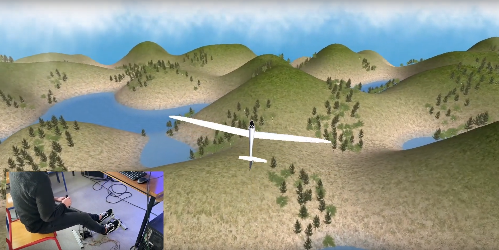

# VRHanglider

  

Fly sim in virtual reality with using a 3D procedural environment made with Unity. The simulator uses sensors connected to an ESP32 micro controler. Developed on an Oculus Go headset. Programmed in C#, C++, and Python
